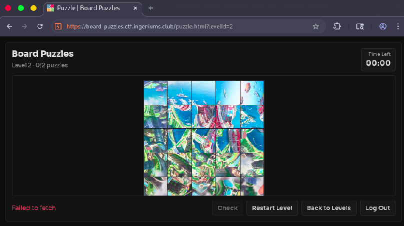
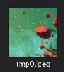
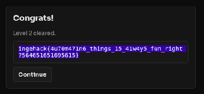

# Board Puzzles 🧩

> **Ingeniums & ACS CTF - IngeHack 5.0** | Misc 

## The Challenge Description
ctfs are too boring for you, and you want to solve some puzzles?        
we got you, enjoy it !

the game is at https://board-puzzles.ctf.ingeniums.club/ 

after following the given link its a login page where u get into a puzzle game with two levels.

**Level 1:** 5 puzzles made of 16 tiles each, 4 minutes to solve them all - easy to do manually ✅

**Level 2:** 2 puzzles to solve in 1 minute total
- Puzzle 1: 25 tiles
- Puzzle 2: 36 tiles  

**Problem:** impossible to manually solve it. So either the game is rigged or u need to be faster than a normal person... the answer is **automation**! 



---

## The Approach

The game has 4 main API methods I found by opening it in Burp Suite:

### 1. **Login** - POST
Verifies credentials and gives u a bearer auth token

### 2. **Start** - GET  
Gets triggered every time u access a level, pass to the next one, or retry it. In the **response object** u will find the tiles of the current level id and puzzle id (base64 encoded), plus a URL to the full reference image

### 3. **Check** - POST
Verifies if the current tiles rotations match the intended solution. U need to provide:
- level id
- puzzle id  
- **the rotations array** (the important part!)

### 4. **Restart** - POST
Reloads the level. Send true to get a new random puzzle, false to just retry the current one

---

## What is a Tile?



A tile is just a square piece from the scrambled image. To make it correct u need to rotate it to match the reference image. There are 4 possible rotations: **0°, 90°, 180°, 270°**

So for each tile in the puzzle, u need to figure out how many rotations it needs. That's what goes in the rotations array.

---

## The Solution

### Part 1: Collect All Possible Images - `codei.py`

First I wrote a script to spam the restart button and collect all possible images that could load. I decode the base64 tiles into actual images and save them in folders for each puzzle.

This is basically building a database by:
1. Hit start → get response with base64 tiles
2. Decode them to PNG/JPG files
3. Spam restart to get new puzzles
4. Save everything organized

---

### Part 2: Automate the Solving - `automate.py` & `automate2.py`

Now the actual solving part. The script does this:

1. Send request to start
2. Get the current response object
3. Decode the base64 tiles and save them temp
4. Load the reference image from the URL
5. For each tile, try rotating it 0°, 90°, 180°, 270°
6. **Compare each rotation to the matching part of the reference image**
7. Return which rotation has the best match
8. Build the rotations array with all results

**The key insight:** I need to match rotated tiles with the reference. How do I know which rotation is correct? By comparing pixel colors!

### Understanding the Tile Matching Problem

The issue I had was: **how do u compare two images to see if they match when rotation causes quality loss?**

Initially I tried hashing:
```python
# ❌ Doesn't work - rotation reduces quality
hash1 = imagehash.average_hash(image1)
hash2 = imagehash.average_hash(rotated)
minimum = min(minimum,abs(hash1-hash2))  # Fails due to compression
```

**The solution was pixelmatch:** Instead of hashing, just compare the actual pixel RGB values. An image is defined by (width × height) pixels, and each pixel has RGB values from 0-255.

So u:
1. Rotate the tile
2. Get the difference in RGB for each pixel between rotated and reference
3. Add up all the differences
4. The rotation with the **smallest total difference** is the correct one!

```python
# This works ✅
diff += ((pixels[i,j][0]-pixels2[i,j][0])**2) + ((pixels[i,j][1]-pixels2[i,j][1])**2) + ((pixels[i,j][2]-pixels2[i,j][2])**2)
# Smallest error = best match
```

For the max error threshold, I calculated:
- **automate.py (25 tiles):** 216×216×256×3 (width × height × max_color_range × RGB_channels)
- **automate2.py (36 tiles):** 320×320×256×3

Just took a close power of 10 number to be the max possible value.

---

### Part 3: The Exploit

1. Reload the level 2 page (starts the 1 minute timer)
2. U have around **58 seconds to work with**
3. Run the automate.py script
4. Intercept the check request in Burp Suite
5. Replace the rotations array (which was all zeros) with the computed one
6. Send it
7. **~5 seconds later** - first puzzle solved ✅
8. Next puzzle shows up (25 tiles → 36 tiles)
9. Run automate2.py, repeat steps 4-6
10. **~4 seconds left** - second puzzle solved ✅
11. Get redirected and receive the flag!



---

## The Problems I Hit

### 1. Image Rotation Quality Loss

When u rotate an image using PIL or any image library, the quality reduces. Even though the size stays the same (width/height), the metadata decreases about 40%. This means if u try to compare using hashes, they won't match even if the tile is correct.

**Solution:** Switched to pixel-level RGB comparison instead of hashing. No more quality issues.

### 2. Matching Rotated Tiles

At first I tried different methods:
- PIL hashing ❌
- XOR comparison ❌  
- cv2 methods ❌

Until I learned about **pixelmatch** - comparing the actual RGB differences between pixels instead of trying to hash or do fancy operations. Way more reliable.

---

## Tools Used

- Burp Suite - to intercept and modify requests
- Python (requests, PIL, Images ) - for automation
- The game's own API endpoints

---

## Files

I attached the python scripts and yes that how I did it no optimization ,I just wanted a functional solve .
and before u ask I also attached the pumpkin folder (the solved reference image) and the tmp folder (the scrambled puzzle) so u can try to solve it automatically!

---
