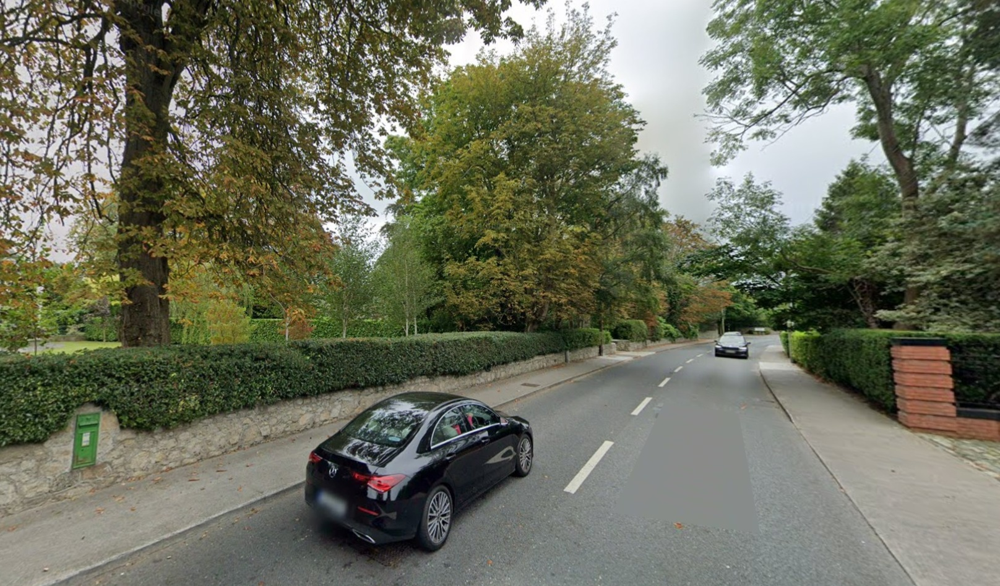
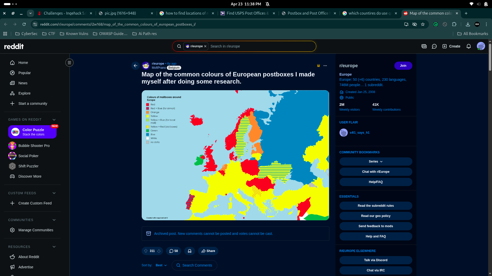
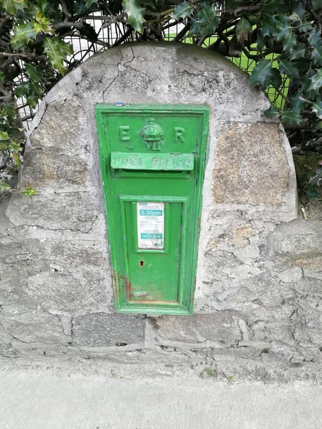
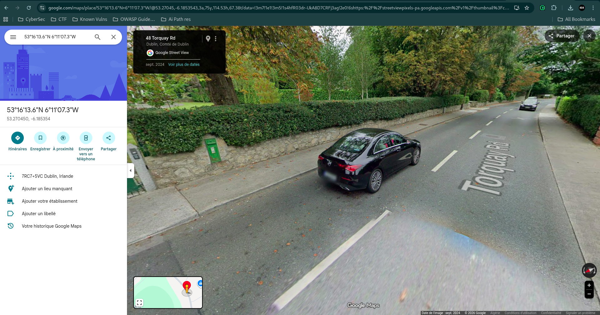

# MailBox 📮

> **Ingeniums & ACS CTF - IngeHack 5.0** | OSINT

## The Challenge Description

Your friend told you they're gonna send you a mail. All you're given is a single image. That's it. No address, no hints, no location. Just a picture.

---



---

**Your mission:** Find the exact coordinates of where this mailbox is located.

---

## The Approach

### Part 1: Initial Reconnaissance - Extract Visual Clues

Opening the image, I immediately spotted **two critical details:**

1. **Traffic Pattern** - Cars driving on the **LEFT side of the road**
   - This narrows down to: UK, Ireland, Australia, Japan, and a handful of others
   - But combined with the mailbox style... UK region is most likely

2. **The Mailbox** - A **distinctive green mailbox embedded in a wall**
   - Not a typical standalone mailbox
   - This is a **European mail collection box** - very specific design

**Key insight:** The combination of left-side driving + European wall-mounted green mailbox is extremely specific. This isn't random.

---

### Part 2: Mailbox Color Research - Narrowing Down the Country

---



---

I started researching mailbox colors across European countries. Each country has their own postal service with distinct mailbox colors:

- **France:** Yellow
- **Germany:** Yellow  
- **UK:** Red
- **Ireland:** GREEN ✅

**Success!** The green mailbox is **Ireland-specific**. Irish postal service (An Post) uses distinctive green mailboxes.

---


---

**Double confirmation:**
- Left-side driving = Ireland ✅
- Green mailbox = Ireland ✅
- Wall-mounted European style = Ireland ✅

At this point, I knew: **The location is somewhere in Ireland.**

---

### Part 3: The Critical Search - Reverse Image Lookup

Now I had to find THIS specific mailbox in Ireland. Out of thousands of green mailboxes, which one?

**Strategy:** Crop the mailbox from the image and run it through **reverse Google image search**.

---

---

After scrolling through hundreds of results with various mailboxes, I found an **exact visual match** in someone's photo collection.

---



---

**Where?** A **Facebook group post** about Irish postal heritage:
- Link: https://web.facebook.com/groups/967516084307068/posts/1361057801619559/?_rdc=1&_rdr#

---

### Part 4: The Comments Section - The Golden Lead

The Facebook post had comments from locals discussing the mailbox. In the replies, someone asked about the exact location, and a user responded:

> **"It's on Torquay Road, Foxrock"**

That's all I needed.

---

### Part 5: Geolocation Confirmation - Google Maps & Street View

Opened Google Maps, searched **"Torquay Road, Dublin, Ireland"** and activated Street View.

Scanned the street for around **5 minutes**, looking for the distinctive green mailbox...

**FOUND IT.** 

The mailbox was visible in the Street View imagery at:

---



---

📍 **Torquay Road, Foxrock, Dublin, Ireland**

**Coordinates:**
```
Latitude: 53.270
Longitude: -6.185
```

Street View Link:

https://www.google.com/maps/place/Torquay+Rd,+Dublin,+Irlande/@53.27045,-6.1853543,3a,75y,107.64h,77.03t/data=!3m7!1e1!3m5!1s4hfR03dr-UkA8D7CRFj3ag!2e0!6shttps:%2F%2Fstreetviewpixels-pa.googleapis.com%2Fv1%2Fthumbnail%3Fcb_client%3Dmaps_sv.tactile%26w%3D900%26h%3D600%26pitch%3D12.969835285714069%26panoid%3D4hfR03dr-UkA8D7CRFj3ag%26yaw%3D107.63694957884984!7i16384!8i8192!4m15!1m8!3m7!1s0x486708567fe262d3:0x38b49da24e6da1ab!2sTorquay+Rd,+Dublin,+Irlande!3b1!8m2!3d53.2715507!4d-6.1867524!16s%2Fg%2F1tjrpd5v!3m5!1s0x486708567fe262d3:0x38b49da24e6da1ab!8m2!3d53.2715507!4d-6.1867524!16s%2Fg%2F1tjrpd5v?entry=ttu&g_ep=EgoyMDI2MDQyMi4wIKXMDSoASAFQAw%3D%3D

---

## The Solution Process Breakdown

| Step | Action | Result |
|------|--------|--------|
| 1 | Extract visual clues from image | Left-side driving + green mailbox |
| 2 | Research mailbox colors by country | Green = Ireland 🇮🇪 |
| 3 | Reverse image search the mailbox | Found Facebook post with exact match |
| 4 | Read comments for location details | Torquay Road, Foxrock |
| 5 | Verify on Google Maps Street View | Confirm coordinates |

---

## The Key Insights

### Why This Worked

1. **Mailbox Color Research**
   - Most people wouldn't think to research postal service design standards
   - But every country's mail service has a **distinct visual identity**
   - This is one of the fastest ways to narrow down a location from a single photo

2. **Reverse Image Search Power**
   - Google's reverse image search is incredibly powerful for OSINT
   - Someone had already photographed this exact mailbox
   - One Facebook post was all it took

3. **Community Intelligence**
   - Local people discussing landmarks online are goldmines for OSINT
   - Facebook groups, Reddit threads, forums - they often contain location confirmation
   - A single comment gave away the exact street name

### The Intelligence Chain

```
Visual Clue (green mailbox) 
    ↓
Historical Knowledge (Irish postal standards)
    ↓
Reverse Image Search (exact match found)
    ↓
Community Source (Facebook comments)
    ↓
Verification (Google Maps Street View)
    ↓
Flag: ingehack{53.270,-6.185}
```

---

## Tools Used

- **Google Reverse Image Search** - Finding the exact mailbox location
- **Google Maps** - Verifying coordinates and Street View
- **Facebook** - Community intelligence and confirmation
- **Browser DevTools** - Extracting image data and metadata

---

## Flag

```
ingehack{53.270,-6.185}
```

---

## Lessons Learned

**OSINT is layered detective work:**
1. Extract what you see (visual analysis)
2. Research what it means (historical/regional knowledge)
3. Find where it exists (reverse search)
4. Confirm with community sources (user-generated content)
5. Verify the exact spot (mapping tools)

One photo. Five steps. Located in Ireland. 🎯

---
